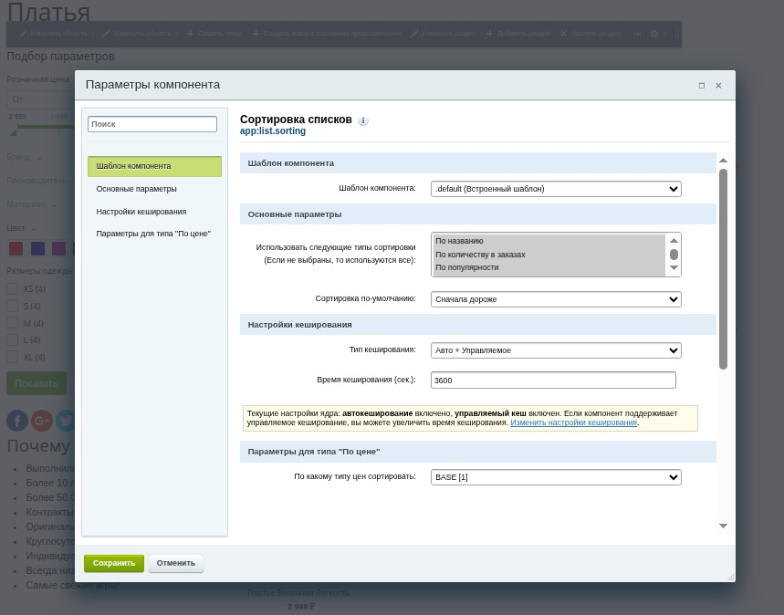

# Компонент сортировки списков

Компонент подключается перед подключением компонента списка (напр. bitrix:catalog.section).

**В публичке:** рисует над списком поле с выбором сортировки.

**В коде:** возвращает массив из 2-х параметров: поле сортировки и направление. Эти параметры надо передать в параметры списка, в "_ELEMENT_SORT_FIELD_" и "_ELEMENT_SORT_ORDER_" соответственно.

### Фишки:
- **Разработка**: абстрактные классы, трейты, интерфейсы, кеширование компонента, кеширование запросов в БД, аякс на action в классе, подписанные параметры.
- Поддерживает визуальный интерфейс настройки параметров (в "эрмитаже").
- Выбор сохраняется в сессии и применяется в прочих списках, использующих этот компонент

### Замечания:
- Не оформлено в модуль, потому что по фукционалу ничего не даст, кроме автозагрузки классов. Для применения в реальном проекте лучше вынести классы в свое пространство в local/php_interface. [Пример модуля](https://github.com/Lvovich/views-counter)
- Типы сортировки добавляются путем добавления классов в папку SortingTypes. Класс должен расширять [AbstractSortingType.php](local/components/app/list.sorting/AbstractSortingType.php) (и реализовывать методы [SortingTypeInterface.php](local/components/app/list.sorting/SortingTypeInterface.php), соответственно). Класс типа также предоставляет параметры для настройки в эрмитаже (пример [Price.php](local/components/app/list.sorting/SortingTypes/Price.php))

**Подключение компонента** - см. коммит "Inclusion of the component."

**Подключение нового типа сортировки** - см. коммит "Adding a new sorting types."

### Результаты:

